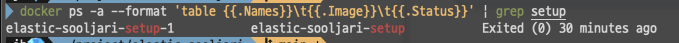

# 서버에 올리는 방법

## Pre
이 절차는 딱 한번만 제대로 하면 된다.
```bash
docker-compose up setup
```

### 제대로 실행되었는지 확인하는 법
```bash
docker ps -a --format 'table {{.Names}}\t{{.Image}}\t{{.Status}}' | grep setup
```
위 명령어를 실행해서, 



`Exited(0)`가 확인되면 정상 실행 완료!

## 실행
```shell
docker-compose up -d
```

## `.env` 패스워드 변경
`.env`에 적혀있는 패스워드는 기본값이므로,<br>
패스워드를 난수로 초기화하고 값을 바꿔주자.

바꾼 값을 레포에 커밋하는 바보 짓은 하지말자!

### 1. 비밀번호 초기화
```bash
docker-compose exec elasticsearch bin/elasticsearch-reset-password --batch --user elastic
```
```bash
docker-compose exec elasticsearch bin/elasticsearch-reset-password --batch --user kibana_system
```

일단 엘라스틱서치와 키바나만 사용하기 때문에 두 유저 정보의 비밀번호만 초기화해준다.

### 2. `.env` 파일 수정
위 커맨드를 실행하면,
```
Password for the [elastic] user successfully reset.
New value: (새로운 비밀번호)
```
예시같은 텍스트가 출력되는데, 새로운 비밀번호 값을 복사해다가 `.env` 파일에 넣어주자.

패스워드 잃어버리면 골치아파질지 모르니 바로바로 바꿔넣어주자.
